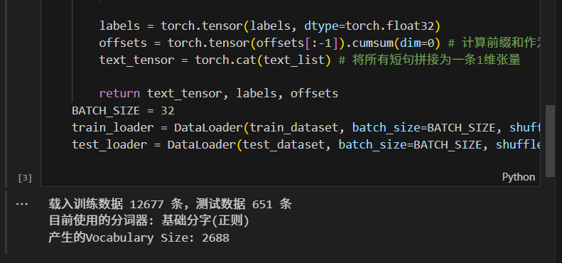
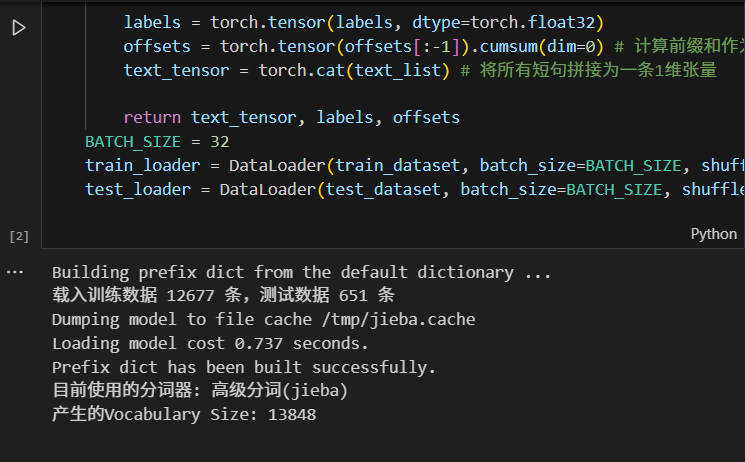

# CS310 Assignment 1 Report: Neural Network for Text Classification
Junming Feng-12311031
## 1. Data Processing & Tokenizer Comparison

The original dataset (`train.jsonl` and `test.jsonl`) was processed and loaded into PyTorch `DataLoader`. Two tokenizers were used:
- **Basic Tokenizer**: Treats each single Chinese character as a word (token) and removes all non-Chinese characters using regular expressions.
- **Advanced Tokenizer**: Uses `jieba` to find multi-character words and keeps things like English words, numbers, and punctuation.

### Influence on Vocabulary Size

| Tokenizer | Vocabulary Size |
| :--- | :--- |
| Basic Tokenizer | 2688 |
| Advanced Tokenizer (`jieba`) | 13848 |

- **Basic Tokenizer Result**:  
  

- **Advanced Tokenizer Result**:  
  

**Analysis**: Using the advanced tokenizer (`jieba`) made the vocabulary size much larger (over 5 times, from 2,688 to 13,848). This happens because `jieba` groups Chinese characters into longer, real words and also keeps English letters, numbers, and punctuation. This creates many more unique words compared to just using single Chinese characters.

## 2. Model Architecture

The neural network model is built using the `torch.nn` module:
1. **Bag-of-Words Embedding**: Used `nn.EmbeddingBag(mode='mean')` to change sentences of different lengths into word vectors of the same size.
2. **Fully-Connected Component**: Used `torch.nn.Sequential` to build the network, with **two hidden layers**:
   - `Linear(embed_dim, hidden_dim1)` + `ReLU()` + `Dropout(0.3)`
   - `Linear(hidden_dim1, hidden_dim2)` + `ReLU()` + `Dropout(0.3)`
   - `Linear(hidden_dim2, 1)` + `Sigmoid()` (Outputs a probability between 0 and 1 for binary classification)

## 3. Training and Evaluation Results

The models were trained for 10 epochs using `BCELoss` and tested on the test dataset. The results are shown below:

| Metric | Basic Tokenizer | Advanced Tokenizer (`jieba`) |
| :--- | :--- | :--- |
| **Test Accuracy** | 0.7066 | 0.6160 |
| **Test Precision** | 0.4234 | 0.3473 |
| **Test Recall** | 0.3412 | 0.5353 |
| **Test F-1 Score** | 0.3779 | 0.4213 |

**Result Summary**: The code runs well and records the performance. The advanced tokenizer got a lower Accuracy. This is mainly because the large vocabulary caused the model to overfit on our small dataset. However, it got a better Recall (0.5353) and a better overall F-1 Score (0.4213). This shows that the advanced tokenizer is better at finding humor when it looks at whole words instead of just single characters.
