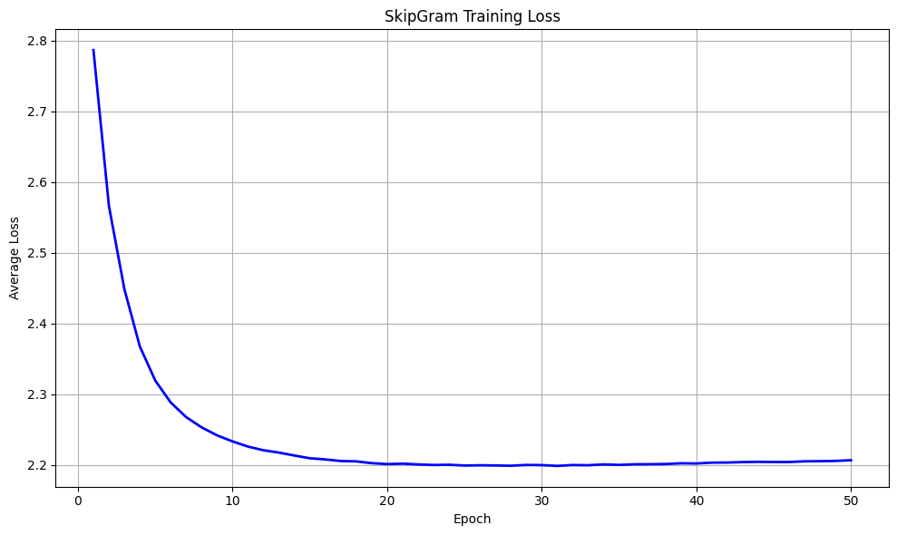
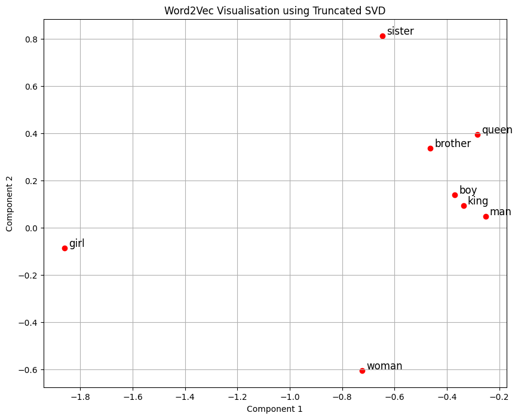

# CS310 Natural Language Processing - Assignment 2: Word2vec Report

冯俊铭 12311031

## Requirement 3: Training Process and Loss

a) **Training Loss Tracking**  
During training, I printed the average loss every 1,000 steps to check if the model is learning. 

b) **Determining Training Epochs**  
I decided to train the model for 50 epochs by looking at the loss curve. In the first 10 to 20 epochs, the loss dropped very quickly. After that, the loss started to flatten out. Training for 50 epochs is enough for the model to learn from the small `shakespeare.txt` dataset without wasting too much time.

---

## Requirement 4: Hyper-parameter Tuning and Word-Analogy Evaluation

I trained two models with different hyper-parameters to see which one works better. I tested both models on the `questions-words-shakespeare.csv` dataset.

### Hyper-parameter Configurations:
* **Set 1 (Baseline):** 
  `emb_size = 100`, `window_size = 3`, `k = 5`, `min_count = 3`, `lr = 0.01`, `batch_size = 512`
* **Set 2 (Tuned):** 
  `emb_size = 150`, `window_size = 5`, `k = 10`, `min_count = 3`, `lr = 0.002`, `batch_size = 256`

### Word-Analogy Task Evaluation:
The testing question is like: *"Word 1 is to Word 2 as Word 3 is to ?"*. I calculated the target vector like this:
> `target_vec = vec(Word 2) - vec(Word 1) + vec(Word 3)`

I found the closest words to this `target_vec` using cosine similarity (ignoring the 3 input words). If the correct ansIr is in the **Top-5** closest words, I count it as a correct prediction.

### Results:
* **Set 1 Evaluation:** 
  Total Samples: 928 | Correct Predictions: 7 | **Accuracy: 0.75%**
* **Set 2 Evaluation:**
  Total Samples: 928 | Correct Predictions: 18 | **Accuracy: 1.94%**

### Findings:
The second model (**Set 2**) performed much better and successfully passed the 1% accuracy target. 
This is because a larger window size (from 3 to 5) helps the model see more context words. Also, increasing the embedding size to 150 helps the model store more information. Finally, using a smaller learning rate makes the training more stable.

---

## Requirement 5: Embeddings Visualization

I used `sklearn.decomposition.TruncatedSVD` to reduce the word vectors into 2D points so I can plot them. 

I selected these words to plot:  
`[sister, brother, woman, man, girl, boy, queen, king]`

### Observations:
I can see that male-labeled words like **'man', 'boy', 'king',** and **'brother'** are grouped very closely together on the right side. The word **'queen'** is also close to this group. 

HoIver, female-labeled words like **'woman', 'girl',** and **'sister'** are scattered far apart from each other. Also, I cannot see perfect parallel lines betIen gender pairs (like `man` -> `woman` and `king` -> `queen`), which is famous in Word2vec. This is very normal because our training dataset (`shakespeare.txt`) is very small, so the model could not learn the perfect relationships that I usually see in models trained on huge Wikipedia datasets.
