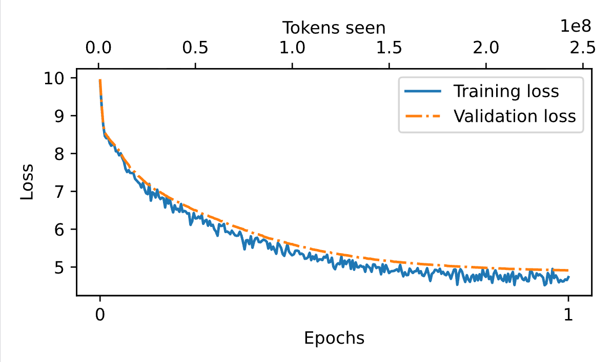

# CS310 NLP Assignment 3 Report: Pretraining a GPT-2 Model on Chinese Wikipedia
> Feng Junming 12311031

## 0. Experimental Setup
- Main code files:
  - `preprocess_wiki_zh.py`
  - `train_tokenizer_from_scratch.py`
  - `compare_tokenizers.py`
  - `run_pretrain.py`
  - `utils.py`

---

## 1. Requirement 1: Data Extraction and Preprocessing

### 1.1 Method
- The raw corpus comes from shard files under the `wiki_zh` directory (one JSON object per line).
- During preprocessing, the `title` and `text` fields are extracted and concatenated.
- `<|endoftext|>` is appended between documents, and the merged corpus is saved as `wikizh.txt` for tokenizer training and pretraining.

### 1.2 Results
- Number of processed files: **1274**
- Number of extracted documents: **1,043,224**
- Number of invalid JSON lines: **0**
- Total number of characters: **452,493,892**
- Output corpus file: `wikizh.txt`

### 1.3 Evidence
- Evidence file: `preprocess_stats.json`
- Script: `preprocess_wiki_zh.py`

---

## 2. Requirement 2: Train a BPE Tokenizer from Scratch

### 2.1 Training Configuration
- Input corpus: `wikizh.txt`
- Requested vocabulary size: **52,000**
- Actual vocabulary size: **52,000**
- Pre-tokenizer: **ByteLevel**
- Minimum frequency: **2**

### 2.2 Training Results
- Output tokenizer file: `wikizh_tokenizer_bytelevel.json`
- Total non-empty lines in corpus: **7,424,610**
- Total number of corpus tokens (counted by the new tokenizer): **258,905,826**

### 2.3 Comparison with the Original GPT-2 Tokenizer
- Sample text: `太阳照常升起。`
- Number of tokens by the new tokenizer: **5**
- Number of tokens by the original GPT-2 tokenizer: **16**
- Under ByteLevel tokenization, decoding a single token may look like byte-level fragments (e.g., `Ġ太éĺ³`), which is expected. The comparison still shows that the new tokenizer produces much more compact segmentation for Chinese text.

### 2.4 Data Sources
- Training statistics file: `tokenizer_report_bytelevel.json`
- Comparison result file: `compare_tokenizers_result_bytelevel.json`
- Scripts:
  - `tokenizer_report_bytelevel.json` is generated by `train_tokenizer_from_scratch.py`
  - `compare_tokenizers_result_bytelevel.json` is generated by `compare_tokenizers.py`
  - `wikizh_tokenizer_bytelevel.json` is generated by `train_tokenizer_from_scratch.py`

---

## 3. Requirement 3: Complete the Pretraining Script

### 3.1 Implemented Features
- Supports loading training data from either a single file or a directory, and building train/validation dataloaders
- Tracks `global_step` and `tokens_seen` during training
- Evaluates and records train/validation loss every `eval_freq` steps
- Saves checkpoints every `save_ckpt_freq` steps
- Saves `model_last_checkpoint.pth` and `model_final.pth` at the end of training
- Automatically exports `run_summary.json`, `final_summary.json`, and `training_metrics.csv/json`

### 3.2 Final Model Hyperparameters (for this run)
- `vocab_size=52000` (matched with tokenizer)
- `context_length=1024`
- `emb_dim=768`
- `n_heads=12`
- `n_layers=12`
- `drop_rate=0.1`
- `qkv_bias=False`

### 3.3 Data Sources
- Implementation files: `run_pretrain.py` (training pipeline), `utils.py` (model and loss utilities)
- Training configuration file: `model_checkpoints_seed10086_wd001_bytelevel/run_summary.json`
- Final configuration and result summary: `model_checkpoints_seed10086_wd001_bytelevel/final_summary.json`

---

## 4. Requirement 4: Pretrain from Scratch and Report Results

### 4.1 Training Parameters
- Training data: `./wikizh.txt`
- Tokenizer: `./wikizh_tokenizer_bytelevel.json`
- Number of epochs: `n_epochs=1`
- Batch size: `8`
- Train/validation split: `0.9 / 0.1`
- Initial learning rate: `1e-4`
- Weight decay: `0.01`
- Seed: `10086`
- `eval_freq=100`, `eval_iter=10`, `save_ckpt_freq=1000`
- Number of training batches per epoch: `29674`
- Actual finished training step: `29600`

### 4.2 Training Process and Loss Curve
- Number of evaluation points: **296**
- First evaluation (step=100): `train_loss=9.9028`, `val_loss=9.9659`
- Around `100M tokens` (step=12300, tokens=100,761,600): `train_loss=5.3320`, `val_loss=5.5873`
- Last evaluation (step=29600): `train_loss=4.7342`, `val_loss=4.9129`
- Best validation loss: `val_loss=4.9129` (step=29600)
- Total tokens seen at the last evaluation: `242,483,200`
- Training duration (at the last evaluation): about `6.76` hours (`24329.59` seconds)

Loss curve files: `loss.pdf`, `loss.png`

### 4.3 Data Sources
- Training log files:
  - `model_checkpoints_seed10086_wd001_bytelevel/training_metrics.csv`
  - `model_checkpoints_seed10086_wd001_bytelevel/training_metrics.json`
- Training configuration file: `model_checkpoints_seed10086_wd001_bytelevel/run_summary.json`
- Final result file: `model_checkpoints_seed10086_wd001_bytelevel/final_summary.json`
- Loss curve files: `loss.pdf`, `loss.png`

---

## 5. Submission Checklist
- Pretraining script: `run_pretrain.py`
- Newly trained tokenizer: `wikizh_tokenizer_bytelevel.json`
- Final model weights: `model_checkpoints_seed10086_wd001_bytelevel/model_final.pth`
- Final report: `A3_report.pdf`
