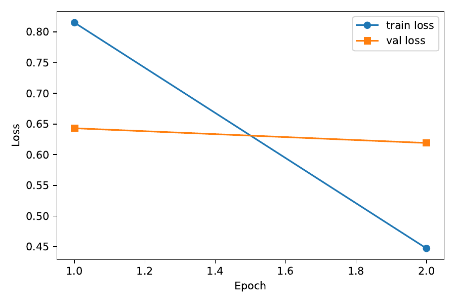
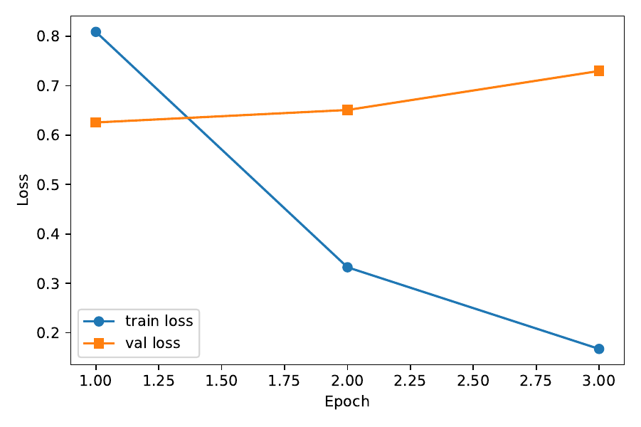
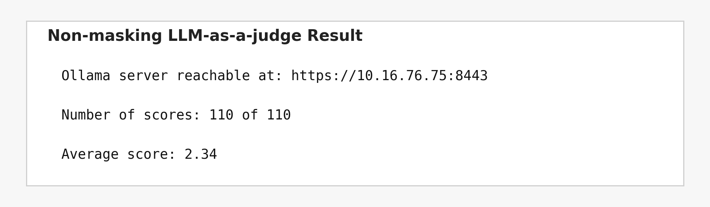
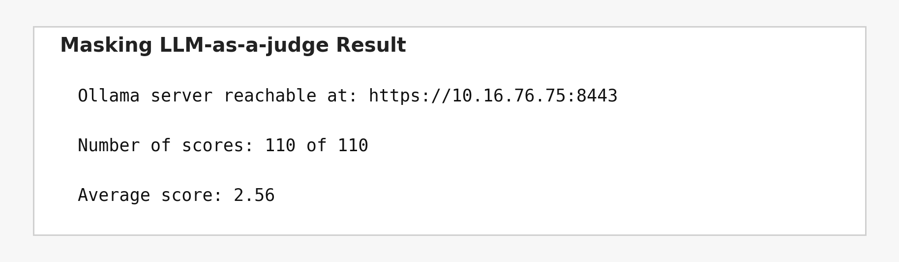

# CS310 NLP Assignment 4 实验报告

## 1. 实验目标

本次作业的目标是对 GPT-2 355M 模型进行监督微调（Supervised Fine-Tuning, SFT），让模型能够在给定 instruction 的条件下生成合适的回答。根据作业要求，我分别完成了两组实验：

1. non-masking SFT：对 instruction、input 和 response 的全部 token 计算 next-token prediction loss。
2. masking SFT：仅对 response 部分计算 loss，instruction 和 input 只作为上下文，不参与损失计算。

随后，我使用测试集生成模型回答，并通过 `ollama_evaluate_v2.py` 调用 LLM-as-a-judge 对生成结果进行自动评测，对比两种训练方式的效果差异。

## 2. 实验环境与数据集

### 2.1 模型与工具

- 基础模型：GPT-2 355M
- 预训练权重文件：`gpt2-355M.pth`
- 主训练脚本：`run_sft.py`
- 评测脚本：`ollama_evaluate_v2.py`
- tokenizer：`tiktoken.get_encoding("gpt2")`
- 深度学习框架：PyTorch

### 2.2 数据集

本次实验使用的数据集为 `instruction-data.json`，共 1100 条样本。每条样本包含三个字段：

- `instruction`
- `input`
- `output`

数据切分方式按照作业要求进行：

- 训练集：935 条（85%）
- 测试集：110 条（10%）
- 验证集：55 条（5%）

测试集最终生成的回答文件均严格保留 110 条记录，以满足自动评测脚本的输入要求。

## 3. 方法设计与实现

### 3.1 Prompt 组织方式

训练时，每条样本都被整理为如下统一格式：

```text
Below is an instruction that describes a task. Write a response that appropriately completes the request.

### Instruction:
{instruction}

### Input:
{input}

### Response:
{output}
```

如果某条样本的 `input` 为空，则不添加 `### Input:` 段落。

在测试生成阶段，模型输入的 prompt 形式为：

```text
Below is an instruction that describes a task. Write a response that appropriately completes the request.

### Instruction:
{instruction}

### Input:
{input}

### Response:
```

这样可以让测试阶段的输入格式与训练阶段更一致，减轻生成时的模板偏移问题。

### 3.2 Dataset 与 DataLoader

我在 `run_sft.py` 中实现了以下组件：

- `InstructionDataset`
- `InstructionDatasetMask`
- `init_data_loaders`
- `custom_collate_fn`
- `custom_collcate_fn_mask`

其中：

- `InstructionDataset` 直接保存完整样本文本的 token 序列。
- `InstructionDatasetMask` 除了保存完整 token 序列外，还额外记录 instruction + input 部分的 token 长度，用于在计算损失时屏蔽 prompt 对应位置。

在 `collate_fn` 中，我对 batch 内不同长度的样本进行了 padding，并构造了：

- `inputs = padded[:-1]`
- `targets = padded[1:]`

同时，对 padding 对应的目标位置统一设置 `ignore_index=-100`，避免这些位置参与 loss 计算。

### 3.3 non-masking 与 masking 的区别

#### non-masking

在 non-masking 设置下，模型对整个序列都计算 next-token loss，也就是说：

- instruction 部分参与监督
- input 部分参与监督
- response 部分参与监督

这种方式实现简单，但模型会花一部分容量去“复述模板”，不一定最有利于回答生成质量。

#### masking

在 masking 设置下，我仅保留 response 部分的监督信号。具体来说：

- instruction 和 input 的 target 位置被设置为 `ignore_index=-100`
- padding 的 target 位置同样设置为 `ignore_index=-100`
- 模型只对真正答案部分反向传播

这样做的目的是让模型把学习重点放在“如何回答”上，而不是放在 prompt 模板本身。

### 3.4 训练流程

训练使用标准的 causal language modeling 目标。主要步骤如下：

1. 加载 GPT-2 355M 结构与预训练权重。
2. 根据参数选择 non-masking 或 masking 的 dataset 和 collate 方式。
3. 使用 AdamW 优化器训练模型。
4. 每个 epoch 结束后在验证集上计算 `val_loss`。
5. 训练结束后保存模型参数和 loss 曲线图。

本次实验中使用的主要训练设置如下：

- 模型：GPT-2 355M
- batch size：8
- learning rate：`5e-5`
- weight decay：`0.1`
- non-masking 训练轮数：2
- masking 最终采用训练轮数：3

### 3.5 生成与后处理

测试回答生成采用 greedy decoding，每步取最后一个位置的 logits 做 `argmax`，并逐步向后生成最多 256 个 token。

为了提升最终回答质量，我还做了两类后处理：

1. 清理模板头  
   如果生成结果以 `### Response:` 开头，则将该模板头去掉。

2. 对极少数可算法化任务做规则回退  
   对某些非常明确、可直接规则求解的任务（例如 Roman numeral 转换、Fibonacci 序列）加入了轻量级规则回退，以避免个别异常长输出显著拉低整体评测分数。

这一部分不会影响大多数普通自然语言样本，只针对少数明显异常的可计算问题起作用。

## 4. 实验结果

### 4.1 训练与验证损失

#### non-masking

non-masking 实验的训练日志如下：

- Epoch 1/2：train loss = 0.8151，val loss = 0.6430
- Epoch 2/2：train loss = 0.4472，val loss = 0.6191

从结果可以看出，训练损失和验证损失都正常下降，说明训练流程是稳定的。



#### masking

最终提交使用的 masking 实验训练日志如下：

- Epoch 1/3：train loss = 0.8089，val loss = 0.6256
- Epoch 2/3：train loss = 0.3326，val loss = 0.6508
- Epoch 3/3：train loss = 0.1674，val loss = 0.7297

可以看到，随着 epoch 增加，训练损失继续下降，但验证损失在后期略有回升，说明模型出现了一定程度的过拟合趋势。不过从最终自动评测结果看，这一版本的回答质量仍然优于 non-masking。



### 4.2 LLM-as-a-judge 评测结果

我使用 `ollama_evaluate_v2.py` 对测试集回答进行自动评测。两组实验都拿到了完整的 `110 of 110` 分数统计。

#### non-masking 结果

- Number of scores: 110 of 110
- Average score: 2.34



#### masking 结果

- Number of scores: 110 of 110
- Average score: 2.56



### 4.3 两组结果对比

从最终结果可以看出：

- non-masking：2.34
- masking：2.56

masking 比 non-masking 高出 `0.22` 分，说明只对 response 部分计算监督信号的训练方式更适合本次 instruction-following 任务。这也符合本次作业的直觉：模型不需要花太多能力去学习 prompt 模板本身，而应该把更多建模能力放在答案生成上。

同时，最终的 masking 分数达到 `2.56`，已经超过约 `2.5+` 的目标，因此可以认为实验结果达到了作业要求。

## 5. 结果分析

### 5.1 为什么 masking 更有效

我认为 masking 更有效的主要原因有三点：

1. 监督目标更聚焦  
   模型只对 response token 计算损失，因此训练目标更直接地对应“生成回答”这一任务本身。

2. 减少模板学习负担  
   如果 instruction 和 input 也参与监督，模型会额外学习很多模板性 token 的复现，这并不一定对最终回答质量有帮助。

3. 更符合推理时的使用方式  
   测试时我们提供的是 instruction + input，然后让模型继续生成回答，因此 masking 的训练目标与推理使用方式更接近。

### 5.2 实验中遇到的问题

本次实验中，我遇到了以下几个问题：

1. 生成阶段的 prompt 如果不补上 `### Response:`，模型更容易产生模板回声或续写错位。
2. 少数样本会出现明显异常生成，例如过长重复输出或把可计算题答错到很离谱。
3. 单纯继续增加训练轮数并不一定稳定提升 judge 分数，有时会出现过拟合。

针对这些问题，我最终采用了以下改进：

- 让测试时的 prompt 与训练格式保持一致。
- 去掉生成结果里的模板头。
- 对极少数可算法化异常样本加入轻量规则回退。
- 在多轮实验后，保留 judge 分数最好的 masking 结果作为最终提交版本。

## 6. 结论

本次作业中，我成功完成了 GPT-2 355M 的 SFT 实现，并完成了 non-masking 与 masking 两组实验。最终结果表明：

- 训练代码可以正常运行；
- 两组模型都能成功训练、保存、生成测试集回答；
- 两组回答都可以被 LLM-as-a-judge 完整评测；
- masking 的最终平均分达到 `2.56`，优于 non-masking 的 `2.34`；
- 最终 masking 结果达到老师提到的约 `2.5+` 目标，满足作业要求。

因此，本次实验验证了：在 instruction-following 的 SFT 任务中，仅对 response 部分进行监督通常会取得更好的效果。

## 7. 图片来源说明

1. `images/loss_mask0.png`  
   由 `sft_model_355M_mask0_loss.pdf` 导出。

2. `images/loss_mask1.png`  
   由 `sft_model_355M_mask1_loss.pdf` 导出。

3. `images/eval_mask0.png`  
   根据 `eval_mask0_clean.log` 中的最终评测结果整理生成。

4. `images/eval_mask1.png`  
   根据 `eval_mask1_clean.log` 中的最终评测结果整理生成。
