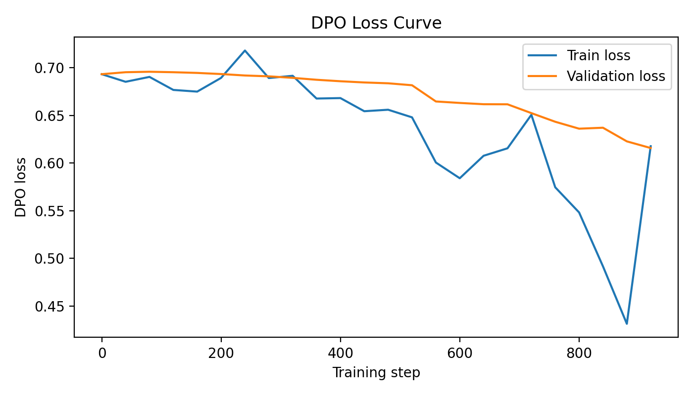
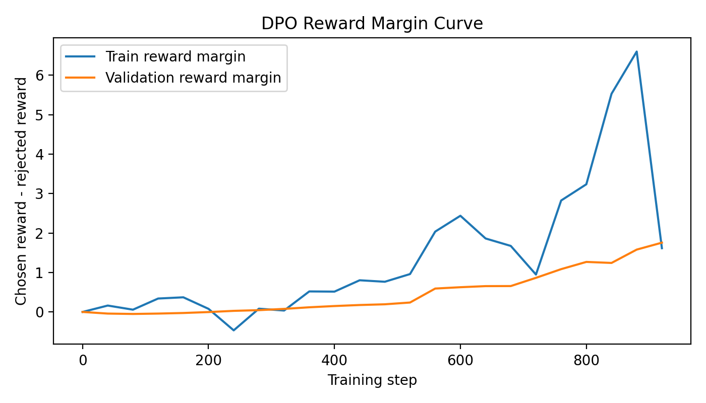
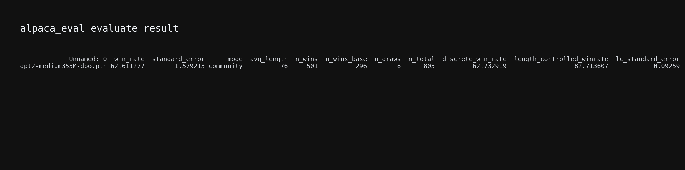

# A5 DPO Experiment Report

> Junming Feng - 12311031

## 1. Objective

This assignment implements Direct Preference Optimization (DPO) for human alignment on top of the GPT-2 Medium 355M SFT checkpoint. The policy model is trained with the preference dataset `instruction-data-with-preference.json`, then used to generate `model_outputs.json` on AlpacaEval. The generated outputs are evaluated with the course-provided Qwen judge through AlpacaEval.

Final evaluation results:

- Raw win rate: **62.61%**
- Length-controlled win rate: **82.71%**
- AlpacaEval examples: **805**

## 2. Experimental Setup

| Item | Configuration |
| --- | --- |
| Initial model | `gpt2-355M-sft.pth` |
| DPO model | `gpt2-medium355M-dpo.pth` |
| Model size | GPT-2 Medium 355M |
| Training data | `instruction-data-with-preference.json` |
| Preference examples | 1100 |
| Effective batch size | 8 |
| Optimizer | AdamW |
| Learning rate | `1e-6` |
| Weight decay | `0.01` |
| DPO beta | `0.1` |
| Training epochs | 1 epoch |
| Generation strategy | Greedy decoding |
| Generation length | `max_new_tokens = 32` |
| Evaluator | Qwen judge via AlpacaEval |

The reference model is initialized from the same SFT checkpoint as the policy model and is kept frozen in evaluation mode. Its chosen and rejected response log probabilities are precomputed before policy updates. This keeps the DPO objective equivalent while reducing the training-time GPU memory peak. The loss is computed only on response tokens; prompt tokens are excluded by the response mask.

## 3. DPO Training Results

The training loop tracks train/validation DPO loss and reward margin. The final records are:

| Metric | Initial value | Final value |
| --- | ---: | ---: |
| Train loss | 0.6931 | 0.6176 |
| Validation loss | 0.6931 | 0.6157 |
| Train reward margin | 0.0000 | 1.6159 |
| Validation reward margin | 0.0000 | 1.7558 |

Loss curve:



Reward margin curve:



The loss curves decrease during training, while the reward margins increase from 0 to clearly positive values. This shows that the DPO-trained policy assigns higher relative probability to chosen responses than to rejected responses compared with the frozen reference model.

## 4. AlpacaEval Generation and Evaluation

The generation script `generate_dpo_responses.py` strictly loads the DPO checkpoint specified by the command-line `--model` argument. The final generated file is:

- `model_outputs.json`
- Number of examples: 805
- Average output length: 76 characters

The provided `reference_outputs.json` contains many repeated prompts or low-quality continuations. Therefore, I used short greedy decoding to reduce GPT-2 repetition during generation. The final evaluation uses the updated `reference_outputs.json`.

The evaluation uses the course-provided Qwen judge configuration. AlpacaEval's default length-controlled metric requires `df_gamed.csv`; the original environment failed when downloading this file from HuggingFace, so I used the local `df_gamed.csv` and successfully ran the default length-controlled evaluation.

Final evaluation command:

```bash
ALPACA_EVAL_DF_GAMED_PATH=/data/student/Fengjunming/Temp/26Spring-NLP-CS310/Assignment/A5/a5_dpo_code/df_gamed.csv \
OPENAI_CLIENT_CONFIG_PATH=/data/student/Fengjunming/Temp/26Spring-NLP-CS310/Assignment/A5/a5_dpo_code/openai_configs.yaml \
alpaca_eval evaluate \
  --model_outputs /data/student/Fengjunming/Temp/26Spring-NLP-CS310/Assignment/A5/a5_dpo_code/model_outputs.json \
  --reference_outputs /data/student/Fengjunming/Temp/26Spring-NLP-CS310/Assignment/A5/a5_dpo_code/reference_outputs.json \
  --annotators_config /data/student/Fengjunming/Temp/26Spring-NLP-CS310/Assignment/A5/qwen_judge \
  --output_path /data/student/Fengjunming/Temp/26Spring-NLP-CS310/Assignment/A5/a5_dpo_code/eval_final32_lc \
  --is_overwrite_leaderboard true
```

Evaluation result screenshot:



Final `leaderboard.csv` result:

| Model | Win rate | Standard error | Avg length | Wins | Reference wins | Draws | Total | Discrete win rate | LC win rate |
| --- | ---: | ---: | ---: | ---: | ---: | ---: | ---: | ---: | ---: |
| `gpt2-medium355M-dpo.pth` | 62.61 | 1.58 | 76 | 501 | 296 | 8 | 805 | 62.73 | 82.71 |

## 5. Deliverables

The final submission package contains:

- `run_dpo.py`
- `generate_dpo_responses.py`
- `model_outputs.json`
- `leaderboard.csv`
- `annotations.json`
- `dpo_tracking.json`
- `dpo_loss_curve.png`
- `dpo_reward_margin_curve.png`
- `alpaca_eval_result.png`
- `A5_DPO_Report.md`
- `Report.pdf`

The DPO checkpoint `gpt2-medium355M-dpo.pth` is saved locally as the resulting model, but it is not included in the submission zip because the assignment submit list requires the training script, generated model outputs, and PDF report.

## 6. Conclusion

This experiment completes DPO training, curve saving, model output generation, and Qwen-judge AlpacaEval evaluation. The final raw win rate is **62.61%**, which is above the required **50%** threshold. The length-controlled win rate is **82.71%**. The local `df_gamed.csv` also resolves the AlpacaEval length-controlled evaluation dependency without relying on a HuggingFace download during evaluation.
